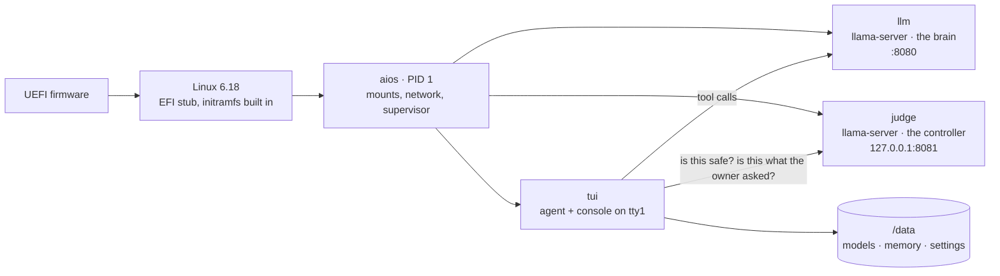
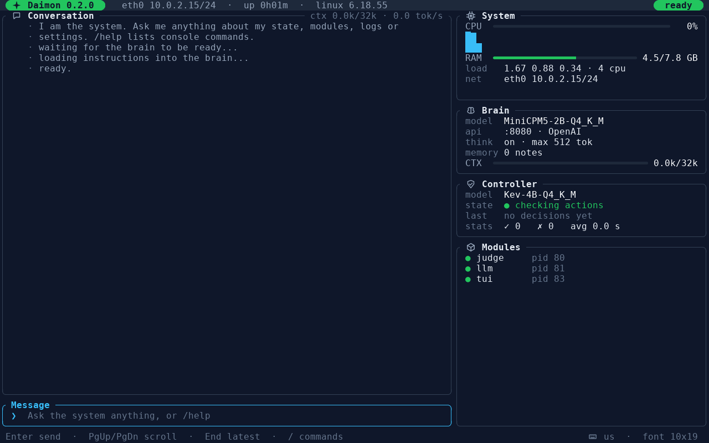
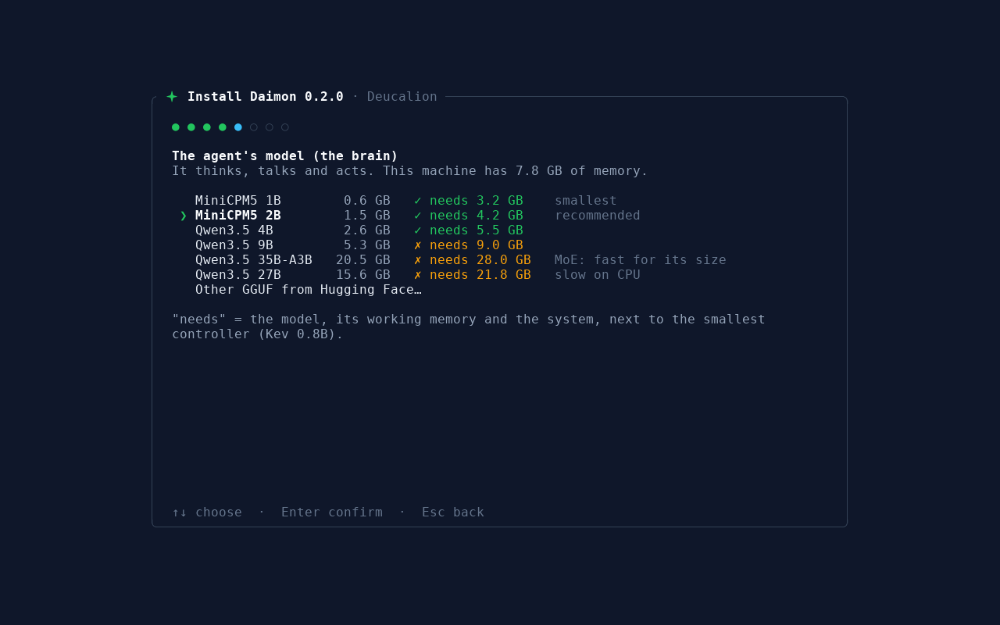

<div align="center">

# Daimon

**An operating system where the language model *is* the system.**

[](PLAN.md#roadmap--0x-deucalion)
[](PLAN.md#name-and-releases)
[](#install)
[](#size)
[](LICENSE)
<br>
[](#install)
[](kernel/aios.config)
[](aios)
[](https://github.com/ggml-org/llama.cpp)
[](#models)

</div>


Daimon is a minimal Linux in which a local language model runs the machine. There is no shell, no package manager
and no systemd: the kernel boots straight into one Rust binary that is init, supervisor, agent and console. You talk
to the system, and the system acts on itself, inspecting its own state, changing its settings, restarting its
modules and remembering what matters. A second, smaller model, the **controller**, judges every change before it
happens.

The whole OS is a single 25 MB EFI file; the installer ISO is 67 MB. The models are downloaded at install time.

> In Unix a *daemon* is the process that quietly runs the machine; in Greek the *daimon* is a guiding spirit.
> Here the model is both.

## How it works



**The brain proposes, the controller judges, the code decides.**

| Layer | What it is | What it does |
|---|---|---|
| Brain | A chat model (MiniCPM5 2B by default) | Understands the owner, plans, calls tools: `status`, `read_file`, `write_file`, `list_dir`, `run`, `config_set`, `restart_module`, `power`, `memory_*` |
| Controller | A decision model ([Kev](https://huggingface.co/ggml-org/Kev-4B-GGUF) 4B by default) served by llama.cpp's `/v1/systemone` | Before every action that changes the system: *does it do what the owner asked?* and *could it break the machine or lock the owner out?* Before every memory: *is it about this system, the agent or the owner?* |
| Code | Rust, in `aios` | Enforces what must never depend on a model: power actions always ask the owner; if the controller is down, every change asks the owner and every memory is refused; the memory tree can't be written by generic file tools |

Every controller decision is shown on screen as a card, with each question, its probability, the threshold and the
verdict, so the owner sees what the system was about to do and why it was stopped or allowed.

## Features

- **Tiny and self-contained**: kernel + init + agent + console + llama.cpp in 25 MB. Userspace is one static Rust
  binary (`aios`, 2.6 MB).
- **Modular**: every component is a supervised module (`/etc/aios/modules`, overridable in `/data/modules`) with
  crash backoff; none is a hard dependency of the others. A frozen console is killed by a watchdog, or by
  **Ctrl+Alt+Del**, which restarts the console instead of rebooting.
- **Long-term memory**: plain Markdown notes in an llm-wiki layout, searched with BM25. By a rule enforced in code
  and judged by the controller, memory holds only three things: the system, the agent itself, and the owner and
  their preferences. Settings and system changes are recorded automatically: one note per setting with its history,
  plus a changelog (reads are filtered out).
- **A console that paints itself**: a ratatui UI drawn directly on the framebuffer with anti-aliased fonts, icons and
  24-bit colour; conversation on the left, system / brain / controller / modules on the right; animated boot splash;
  `/` opens command completion.
- **59 keyboard layouts**, loaded straight into the kernel (no `kbd` package).
- **Safe by default**: validated settings, safe mode (`/safe`), factory reset (`/reset`), fail-closed controller.
- **Installer**: a 67 MB ISO that partitions the disk, installs the system and downloads the models you choose,
  resumable and checksum-verified.



## Size

| | |
|---|---|
| Installer ISO (the release download) | **67 MB** |
| The OS: one EFI file with kernel, init, agent, console and llama.cpp | **25 MB** |
| Default models, downloaded during the install: MiniCPM5 2B (1.5 GB) + Kev 4B (2.8 GB) | 4.3 GB |
| Smallest pair: MiniCPM5 1B (0.6 GB) + Kev 0.8B (0.8 GB) | 1.4 GB |

## Install

**You need** an x86_64 machine or VM with UEFI (Secure Boot off) and a CPU with AVX2, at least 8 GB of RAM for the
default models, a disk of at least 8 GB plus the models (it will be **erased entirely**), and internet during the
installation.

1. Download `daimon-<version>.iso` from the [releases](../../releases).
2. Boot it:
   - **VM / Proxmox**: attach it as a CD-ROM. On Proxmox use `--cpu host` (for AVX2), `--bios ovmf` with
     `--efidisk0 <storage>:1,pre-enrolled-keys=0` (Secure Boot off), a VirtIO disk and 8 GB of RAM or more.
   - **Real hardware**: write it to a USB stick (`sudo dd if=daimon-<version>.iso of=/dev/sdX bs=4M conv=fsync`)
     and boot it in UEFI mode.
3. Answer the installer: keyboard, disk, your name, the machine name, the brain, the controller and, optionally,
   anything you want to add to the agent's instructions. Type `erase` to confirm.
4. When the downloads are done, remove the installation medium and press Enter.



### Models

The installer offers the models that fit the machine's RAM. "Needs" counts the model, its working memory and the
system, from the real file sizes. Nothing here is benchmarked except the controllers.

| Brain | File | Needs, with Kev 4B | Needs, with Kev 0.8B |
|---|---|---|---|
| MiniCPM5 1B | 0.6 GB | 5.5 GB | 3.2 GB |
| **MiniCPM5 2B** (default) | 1.5 GB | **6.5 GB** | 4.2 GB |
| Qwen3.5 4B | 2.6 GB | 7.9 GB | 5.5 GB |
| Qwen3.5 9B | 5.3 GB | 11.3 GB | 9.0 GB |
| Qwen3.5 27B | 15.6 GB | 24.2 GB | 21.8 GB |
| Qwen3.5 35B-A3B (MoE) | 20.5 GB | 30.3 GB | 28.0 GB |

Any other GGUF on Hugging Face can be given as `owner/repo/file.gguf`. The controller is **Kev 4B** (2.8 GB, no
errors in our benchmark, see [PLAN.md](PLAN.md)),
or Kev 0.8B (0.8 GB) on small machines.

## Using Daimon

Talk to it in English (it answers in another language if you ask, and remembers that). Ask about its state, its
logs, its settings; ask it to change something. Actions that look risky or off-request wait for your **y/n**.

Console commands work even when the brain is down; type `/` to see them:

| Command | |
|---|---|
| `/help` | list the commands |
| `/config` | show every setting |
| `/set <key> <value>` | change a setting, e.g. `/set keymap it`, `/set ctx 65536`, `/set ui_font 24` |
| `/keymaps` | list the keyboard layouts |
| `/restart <module>` | restart `llm`, `judge` or `tui` |
| `/new` | new conversation |
| `/safe` | safe mode on/off: factory settings, no `/data` modules, until reboot |
| `/reset` | factory settings |

Keys: `↑↓` `Tab` `Enter` in the `/` popup, `Esc` cancels a running request, `PgUp`/`PgDn` scroll,
**Ctrl+Alt+Del** restarts the console.

The brain's OpenAI-compatible API listens on port **8080** of the LAN. Today it is the bare model, without tools or
controller; the agent itself comes to the LAN in 0.4.

What lives on the data partition:

```
/data/models/            current.gguf (brain) and judge.gguf (controller), links to the downloaded files
/data/memory/            the agent's notes: system/, self/, owner/, plus _index.md
/data/aios/config        settings (key = value), also editable with /set or by asking the agent
/data/aios/system-extra.md   your additions to the agent's instructions
/data/modules/           module overrides: a directory per module with cmd, tty, disabled, watchdog
```

## Build from source

On a Linux host (Ubuntu 24.04 is what we use) with Rust and the `x86_64-unknown-linux-musl` target, gcc, make,
python3 with Pillow, `ckbcomp` (console-setup), `mtools`, `dosfstools`, `e2fsprogs`, `qemu-system-x86` and `ovmf`:

```sh
# Linux 6.18 LTS into build/linux-6.18.55
curl -L https://cdn.kernel.org/pub/linux/kernel/v6.x/linux-6.18.55.tar.xz | tar xJ -C build

# llama.cpp, static, CPU with AVX2, into build/llama.cpp/build-cpu
git clone https://github.com/ggml-org/llama.cpp build/llama.cpp
cmake -S build/llama.cpp -B build/llama.cpp/build-cpu -DCMAKE_BUILD_TYPE=Release -DBUILD_SHARED_LIBS=OFF \
  -DCMAKE_EXE_LINKER_FLAGS=-static -DGGML_NATIVE=OFF -DGGML_AVX2=ON -DGGML_FMA=ON -DGGML_F16C=ON -DLLAMA_OPENSSL=OFF
cmake --build build/llama.cpp/build-cpu --target llama-server -j
```

Then:

```sh
./build.sh          # dev image out/daimon.qcow2 with the models in build/data/models (no installer)
./build.sh run      # build it and boot it in QEMU (screen in a window, API on host :8080)
./build.sh iso      # out/daimon-<version>.iso, the installer
./build.sh run-iso  # build the ISO and install it in QEMU onto a blank 32 GB disk
```

For the dev image, put a brain and a controller in `build/data/models/` as `current.gguf` and `judge.gguf`.
`build.sh` fetches and builds the static `mke2fs` and unpacks `xorriso` itself. QEMU needs KVM; on WSL:
`sudo usermod -aG kvm $USER`, then `wsl --shutdown`.

Tests: `cargo test --target x86_64-unknown-linux-musl` in `aios/`.

### Layout

```
aios/src/      main.rs     PID 1: mounts, supervisor, watchdog, Ctrl+Alt+Del
               agent.rs    the tool-calling loop, tools, system prompt
               judge.rs    the controller's questions and thresholds
               memory.rs   notes, index, BM25, recorded system changes
               tui.rs      the console;  setup.rs  the install wizard;  splash.rs  the boot splash
               install.rs  disks, GPT, downloads;  fb.rs  framebuffer backend;  keyboard.rs  keymaps
               config.rs   settings table;  net.rs  DHCP client, hostname
bench/         controller benchmark (notes and actions) and its raw results
tools/         build-time generators: fonts, keymaps, wordmark
kernel/        kernel config fragment
build.sh       everything else
```

## Roadmap

Every step of the 0.x line is a minor version, all named **Deucalion**; details in [PLAN.md](PLAN.md).

| Version | |
|---|---|
| 0.1 ✅ | Foundation: boot, agent, console, memory, controller, splash |
| 0.2 ✅ | Installable: ISO installer and model download, resilient console, system changes in memory, `/` completion |
| 0.3 | The agent as a service; the console becomes one window on it |
| 0.4 | Daimon on the LAN: the agent, with all its rules, not the bare model |
| 0.5 | Controller hardening: larger benchmark, fine-tuning |
| 0.6 | Autonomy: the system reacts to its own events |
| 0.7 | Skills, installable from GitHub and vetted by the controller |
| 0.8 | Signed A/B updates with rollback |
| 1.0 | **Talos** |

Versions follow semver; the codename changes only with the major version, after mythic matter brought to life:
0.x **Deucalion** (stones that became people), 1.x Talos, 2.x Galatea, 3.x Pandora.

## Limits

Daimon is young. It runs on CPU only (no GPU drivers yet), boots UEFI only, installs on a whole disk, and the RAM
estimate for models is a rule of thumb. The full list is in [PLAN.md](PLAN.md#known-limits).

## License

[GPL-3.0-or-later](LICENSE).
